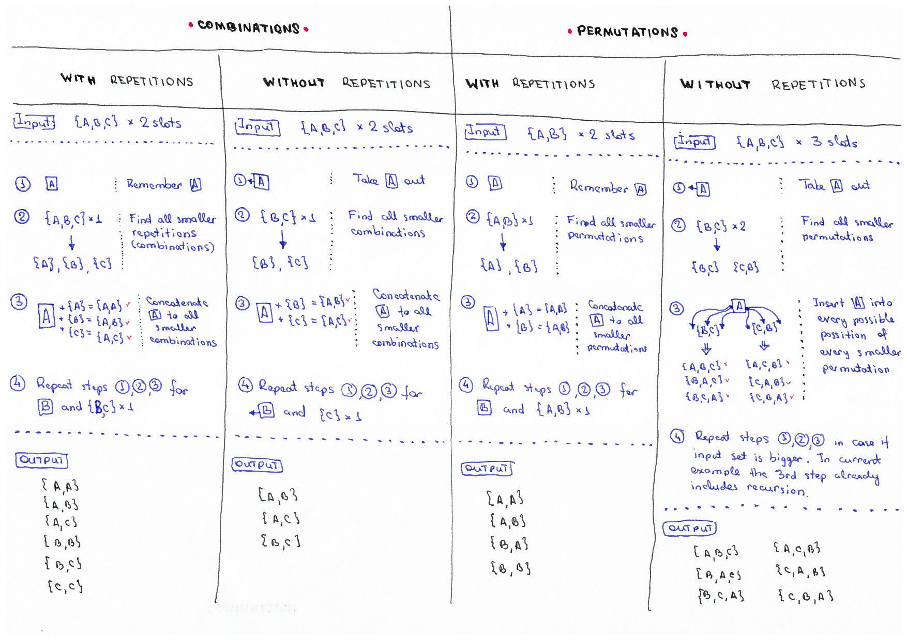

# 排列（Permutation）



## permutate with repetation

```js
options = { A, B }
STEP_1: 记录 A
STEP_2: 寻找所有小一阶排列 --> {A}, {B}
STEP_3: 组合 A 和 小一阶排列 --> {A,A},{A,B}
STEP_4: 重复STEP_1~STEP_3，直到遍历完 options

结果: {A,A},{A,B},{B,A},{B,B}
```

## permutate without repetation

```js
options = { A, B, C }
STEP_1: 取出 A
STEP_2: 寻找所有小一阶排列 --> {B,C}, {C,B}
STEP_3: 将 A 插入小一阶排列的不同位置 --> {A,B,C}, {B,A,C}, {B,C,A}, {A,C,B}, {C,A,B}, {C,B,A}

结果: {A,B,C}, {B,A,C}, {B,C,A}, {A,C,B}, {C,A,B}, {C,B,A}
```