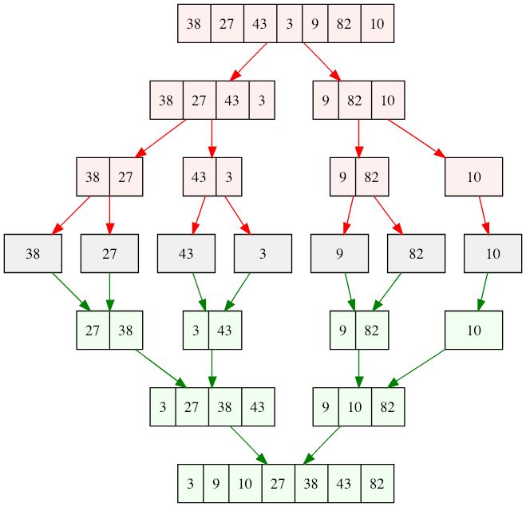

# 归并排序

二分到最小单位，然后合并，真正的排序发生在合并操作里：



递推公式: mergeSort(start..end) = merge(mergeSort(start..middle), mergeSort(middle+1,end))，其中 merge 是合并两个有序数组。

时间复杂度分析：
```js
T(1) = C; // n = 1
T(n) = 2*T(n/2) + n // n > 1，T(n/2) 表示二分之后的一部分排序时间，n 是 merge 用的时间
     = 4*T(n/4) + 2n // 2*(2*T(n/4)+n/2) + n
     = 8*T(n/8) + 3n // 4*(2*T(n/8)+n/4) + 2n
     // ...
     = 2^k * T(n/2^k) + k*n // <-- k = log2(n) <-- T(1) = T(n/2^k)
     = n*T(1) + n*log2(n) // nlogn 
```
----

时间复杂度|空间复杂度|是否稳定|最好时间复杂度|最坏情况时间复杂度
--|--|--|--|--
`O(nlog(n))`|`O(n)`|Y|`O(nlog(n))`|`O(nlog(n))`

----

一个动态示例图：


