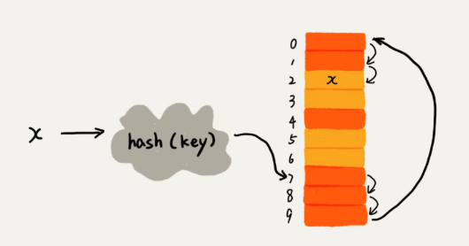

# 哈希表（HashTabel，散列表）

> 散列表（Hash table，也叫哈希表），是根据键（Key）而直接访问在内存存储位置的数据结构。也就是说，它通过计算一个关于键值的函数，将所需查询的数据映射到表中一个位置来访问记录，这加快了查找速度。这个映射函数称做散列函数，存放记录的数组称做散列表。

## 散列冲突

散列函数计算出来的 key，可能会重复，这时就发生了散列冲突。一般通过「开放寻址法」或「链表法」来解决。

一个概念： `装载因子 = 表中已有元素个数 / 散列表的长度`，装载因子越大，发生散列冲突的概率越大。

### 开放寻址法

散列函数结算出位置出现冲突时，从当前位置往后查找，直到找到空闲位置。

* 线性探测

查找时，先通过散列函数计算位置，判断该位置与查找值是否相等，如果相等则说明找到了，否则，顺序继续查找，若出现空闲位置时还没有找到说明元素不存在。

对于删除操作，我们不能直接删除，因为这样会导致无法分辨因为删除还是原本就是空的空闲位置，导致下次查找失败，而应该设置一个已删除标志量。

* 二次探测（）

* 双重散列（有多个散列函数，如果出现散列冲突则使用另一个散列函数计算位置）

### 链表法

通过独立的链解决哈希冲突:

[维基百科 - 哈希表](https://zh.wikipedia.org/wiki/%E5%93%88%E5%B8%8C%E8%A1%A8)