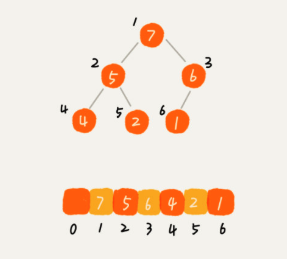

# Heap

堆是一种特殊的基于树（完全二叉树）的数据结构，没有父节点的节点，被称为根节点。

* 在一个「最小堆」中，如果 `P` 是 `C` 的一个父级节点，那么 `P` 的 `key` （或 `value`）应小于或等于 `C` 的对应值。

* 在一个「最大堆」中， `P` 的 `key`（或 `value`）大于 `C` 的对应值。

一个用数组存储堆的例子：

* 增加：直接将新增节点放在堆末尾（数组末尾），然后向上堆化。
* 删除：将堆尾节点替换到要删除的节点位置，向上（或向下）堆化。其中，如果待删除节点是堆顶节点（根节点）或者最后一个节点替换到待删除元素位置后，该节点与待删除节点的父节点符合堆特性（大顶、小顶），那么执行向下堆化（说明上面的顺序都 OK），否则执行向上堆化。

## 参考

1. [极客时间](https://time.geekbang.org/column/article/69913)
2. [维基百科](https://en.wikipedia.org/wiki/Heap_(data_structure))