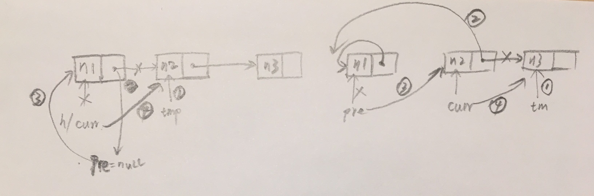

# 单链表反转

[LeetCode: 206. Reverse Linked List](https://leetcode.com/problems/reverse-linked-list)

## 解题

* 迭代

* 递归

假设 nk+1 ～ nm 已经反转 (n1 → … → nk-1 → nk → nk+1 ← … ← nm)，那么 nk 该如何反转？

`nk.next.next = nk` 即可，注意末尾节点的 `next` 置为 `null`。

测试： `npm run test ./data-structures/linked-list/practice/reverse/*.test.ts`