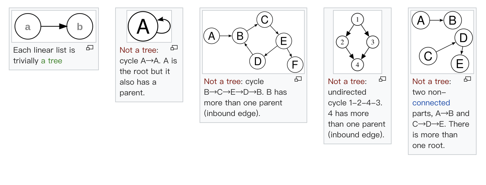

# 树

一棵树：

其它树与非树示例：

几个概念：

* 节点高度：节点到叶子节点的最长路径
* 深度：根节点到此节点的路径
* 层：节点深度 + 1
* 树高度：根节点的高度

二叉树就是每个节点至多有两个子节点的树，常见完全二叉树（不同于满二叉树）。

* 前序遍历：node->left->right
* 中序遍历：left->node->right
* 后序遍历：left->right->node